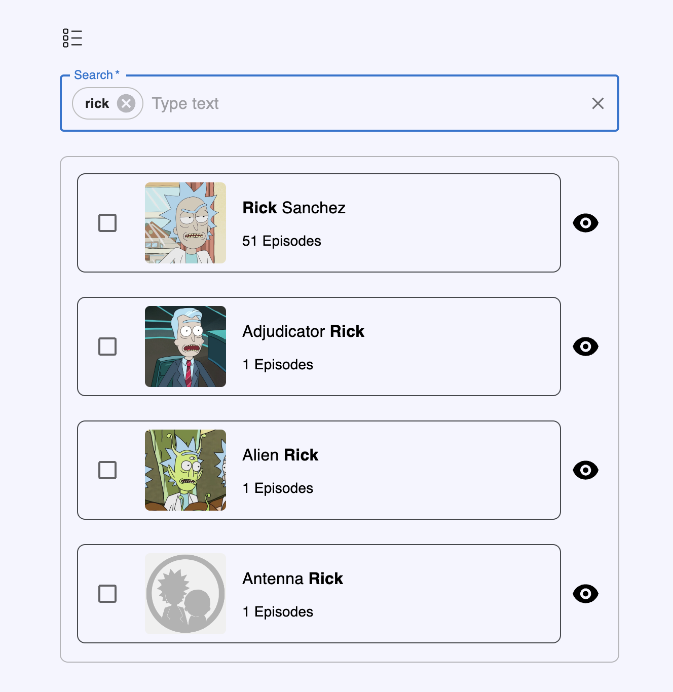
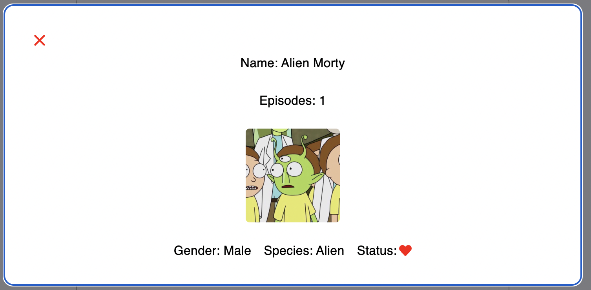
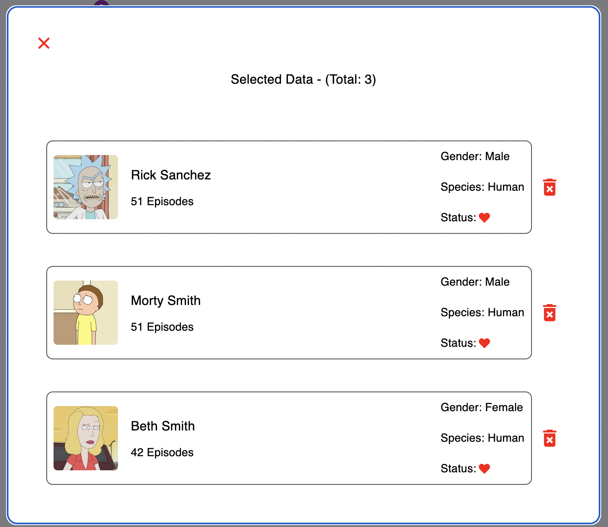

Rick and Morty App

#### About Project : 
##### This web application was made to search for Rick and Morty characters via the API service.
##### As a result of the search, the episode numbers and name information of the characters are shown.
##### Selected characters can be added or removed from the list.
##### You can get the search results again by onclicking the searched text value in the input field.
##### Redux toolkit, material UI was used in the study.

## Installation

Install Rick_and_Morty

```bash
  npm install Rick_and_Morty
  cd Rick_and_Morty
  npm install node_modules
  npm start or yarn start or pnpm dev&start
```


#### Images




